# Store Management System

A complete store management system consisting of a mobile app for users and a web-based backend system for store owners.

## 📱 System Architecture

```mermaid
graph TB
    subgraph Users["👥 End Users"]
        iOS["📱 iOS App"]
        Android["📱 Android App"]
    end
    
    subgraph Owners["👨‍💼 Store Owners"]
        Browser["🌐 Web Browser<br/>(Chrome, Safari, etc)"]
    end
    
    subgraph Frontend["Frontend Layer"]
        RN["React Native App<br/>- Redux Toolkit<br/>- Firebase (optional)"]
        NextJS["Next.js Dashboard<br/>- Material-UI<br/>- React"]
    end
    
    subgraph Backend["Backend Layer"]
        Laravel["Laravel API<br/>- Sanctum Auth<br/>- RESTful API"]
    end
    
    subgraph Data["Data Layer"]
        MySQL[(MySQL Database<br/>- Users<br/>- Products<br/>- Orders)]
    end
    
    iOS -.-> RN
    Android -.-> RN
    Browser -.-> NextJS
    
    RN -->|"HTTP/HTTPS<br/>JSON API"| Laravel
    NextJS -->|"HTTP/HTTPS<br/>JSON API"| Laravel
    Laravel -->|"Query/Update"| MySQL
    
    style Users fill:#e1f5ff,stroke:#01579b,stroke-width:2px
    style Owners fill:#f3e5f5,stroke:#4a148c,stroke-width:2px
    style Frontend fill:#e8f5e9,stroke:#1b5e20,stroke-width:2px
    style Backend fill:#fff3e0,stroke:#e65100,stroke-width:2px
    style Data fill:#fce4ec,stroke:#880e4f,stroke-width:2px
    style RN fill:#61dafb,stroke:#333,stroke-width:2px
    style NextJS fill:#000000,stroke:#333,stroke-width:2px,color:#fff
    style Laravel fill:#ff2d20,stroke:#333,stroke-width:2px,color:#fff
    style MySQL fill:#4479a1,stroke:#333,stroke-width:2px,color:#fff
```



### 1. User Mobile App
- **Platform**: React Native
- **State Management**: Redux Toolkit
- **Target**: iOS & Android customers

### 2. Owner Backend System

#### Frontend
- **Framework**: Next.js
- **UI Library**: Material-UI (MUI)
- **Purpose**: Store owner dashboard and management interface

#### Backend
- **Framework**: Laravel
- **Authentication**: Laravel Sanctum
- **Database**: MySQL

## 🛠️ Technology Stack

### Mobile (React Native)
- React Native
- Redux Toolkit
- Firebase (optional, if using)

### Web Frontend (Next.js)
- Next.js
- Material-UI (MUI)
- React

### Backend (Laravel)
- Laravel
- Laravel Sanctum
- MySQL

## 📋 Prerequisites

### For Mobile App
- Node.js (v16 or higher)
- React Native CLI
- Xcode (for iOS development)
- Android Studio (for Android development)

### For Web Frontend
- Node.js (v16 or higher)
- npm or yarn

### For Backend
- PHP 8.1 or higher
- Composer
- MySQL 8.0 or higher
- Laravel 10.x

## 🚀 Installation

### Mobile App Setup

```bash
# Navigate to mobile app directory
cd mobile-app

# Install dependencies
npm install

# For iOS
cd ios && pod install && cd ..

# Run on iOS
npm run ios

# Run on Android
npm run android
```

### Web Frontend Setup

```bash
# Navigate to web frontend directory
cd web-frontend

# Install dependencies
npm install

# Run development server
npm run dev

# Build for production
npm run build
```

### Backend Setup

```bash
# Navigate to backend directory
cd backend

# Install dependencies
composer install

# Copy environment file
cp .env.example .env

# Generate application key
php artisan key:generate

# Configure database in .env file
# Then run migrations
php artisan migrate

# Start development server
php artisan serve
```

## 📁 Project Structure

```
project-root/
├── mobile-app/          # React Native mobile application
├── web-frontend/        # Next.js admin dashboard
├── backend/            # Laravel API backend
├── LICENSE             # CC BY-NC 4.0 License
└── README.md          # This file
```

## 🔐 Environment Variables

### Backend (.env)
```env
DB_CONNECTION=mysql
DB_HOST=127.0.0.1
DB_PORT=3306
DB_DATABASE=your_database
DB_USERNAME=your_username
DB_PASSWORD=your_password

SANCTUM_STATEFUL_DOMAINS=localhost:3000
```

### Web Frontend (.env.local)
```env
NEXT_PUBLIC_API_URL=http://localhost:8000/api
```

### Mobile App (.env)
```env
API_URL=http://localhost:8000/api
```

## 🌟 Features

### User Mobile App
- Browse store catalog
- Product search and filtering
- Shopping cart
- Order management
- User profile

### Owner Backend System
- Product management
- Order tracking
- Customer management
- Analytics dashboard
- Inventory management

## 🤝 Contributing

Contributions are welcome! Please feel free to submit a Pull Request.

## 📄 License

This project is licensed under the **Creative Commons Attribution-NonCommercial 4.0 International License** (CC BY-NC 4.0).

**This means:**
- ✅ You can use, modify, and share this project for **non-commercial purposes**
- ✅ You must give appropriate credit
- ❌ You cannot use this project for commercial purposes without permission

For commercial use, please contact the project maintainer.

### Third-Party Libraries

This project uses the following open-source libraries, which retain their original licenses:

- **React Native** - MIT License
- **Redux Toolkit** - MIT License
- **Next.js** - MIT License
- **Material-UI (MUI)** - MIT License
- **Laravel** - MIT License
- **Laravel Sanctum** - MIT License

See individual library documentation for their respective license terms.

## 📧 Contact

For commercial licensing inquiries or questions, please contact:
- Email: [your-email@example.com]
- GitHub: [your-github-username]

## ⚠️ Disclaimer

This software is provided "as-is" without any warranties. See the LICENSE file for full details.

---

**Note**: This is a non-commercial project. For commercial use, please obtain proper licensing.
